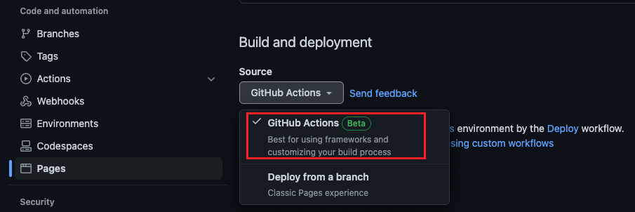

# Deployment to Github Pages via action (Beta, without orphan branch)
In this chapter you will learn how to build and automatically deploy your Angular application.

## Enable GitHub Pages deployment via Action
Go to your repository &rarr; Settings &rarr; Pages &rarr; Build and deployment.
Select `GitHub Actions`, so it will be possible to deploy a page via GitHub Actions.

## Setting up a token
To enable the workflow to commit your built application to the `pages` branch, it needs the permissions to do so.

### GITHUB_TOKEN
For this you can use an automatically generated token called `GITHUB_TOKEN`.
To check the permissions go to your repository &rarr; Settings &rarr; Actions &rarr; General &rarr; Workflow permissions  

  

The permissions should be set to `Read and write permissions`
## Steps of the workflow
For building your angular application and deploy it to GitHub pages, you need to follow these steps:
1. Define an event (on push to master)
2. Configure the workflow permissions
3. Run a container and configure the environment
4. Checkout the code
5. Install Node.js
6. Install dependencies
7. Build the application
8. Setup Pages
9. Upload artifact
10. Deploy to GitHub Pages

## Create the workflow
Create a file named `deploy-on-push-to-master.yml`.

## Define an event
For your workflow you need to define an event which triggers the deployment.
In this case a push to the `main` branch can be useful. Use the following code:
```yml
name: Deploy

on:
  push:
    branches:
      - 'main'
```

## Configure the workflow permissions
To deploy your application to GitHub Pages, the running Job needs to have some additional permissions. These can be defined as seen below ([Assigning permissions to jobs](https://docs.github.com/en/actions/using-jobs/assigning-permissions-to-jobs)).
For more information, have a look at the [GITHUB_TOKEN default permissions](https://docs.github.com/en/actions/security-guides/automatic-token-authentication#permissions-for-the-github_token).

```yml
permissions:
  id-token: write
  pages: write
  deployments: write
```

## Run a container and configure the environment
Running the container is the same as in the previous workflow,
but this time you need to define the environment name and url.
The url will be returned in the step `deployment` by `actions/deploy-pages@v1`:  
`${{ steps.deployment.outputs.page_url }}`  
 It is linked via id.
Have a look at the id defined in the [deployment step](#deploy-to-github-pages).

```yml
jobs:
  docs:
    name: '🌍 Deploy'
    runs-on: ubuntu-latest
    environment:
      name: github-pages
      url: ${{ steps.deployment.outputs.page_url }}
```

## Checkout the code / Install Node.js / Install dependencies
These steps are the same, as in [running-tests workflow.](deployment-to-github-pages.md)

```yml
    steps:
      - name: '☁️ Checkout repository'
        uses: actions/checkout@v3

      - name: '⚙️ Use Node.js'
        uses: actions/setup-node@v3
        with:
          check-latest: true
          cache: 'npm'

      - name: '⛓️ Install dependencies'
        run: npm ci --no-optional --no-audit --prefer-offline --progress=false
```

## Build 
`npm run build --prod` will build the application and create a dist directory with a `Production build` of your project.
The code below will create the build step inside the workflow.

```yml
    - name: '🛠️ Build'
      run: npm run build --prod
```

## Setup Pages
The action [actions/configure-pages@v2](https://github.com/actions/configure-pages)
will enable GitHub pages and prepare the deployment.
```yml
      - name: Setup Pages
        uses: actions/configure-pages@v2
```

## Upload artifact
The action [actions/upload-pages-artifact@v1](https://github.com/actions/upload-pages-artifact)
will upload your files for the deployment. You need to define the path with your deployable application:   
`path: './dist/github-actions-tutorial/'`

```yml
      - name: Upload artifact
        uses: actions/upload-pages-artifact@v1
        with:
          # dist directory of the application
          path: './dist/github-actions-tutorial/'
```

## Deploy to GitHub Pages
The action [actions/deploy-pages@v1](https://github.com/actions/deploy-pages) will deploy your application to GitHub Pages. After this step your application will be available.
```yml
      - name: Deploy to GitHub Pages
        id: deployment
        uses: actions/deploy-pages@v1
```

## The workflow
```yml
name: Deploy

on:
  push:
    branches:
      - 'main'

permissions:
  id-token: write
  pages: write
  deployments: write

jobs:
  docs:
    name: '🌍 Deploy'
    runs-on: ubuntu-latest
    environment:
      name: github-pages
      url: ${{ steps.deployment.outputs.page_url }}

    steps:
      - name: '☁️ Checkout repository'
        uses: actions/checkout@v3

      - name: '⚙️ Use Node.js'
        uses: actions/setup-node@v3
        with:
          check-latest: true
          cache: 'npm'

      - name: '⛓️ Install dependencies'
        run: npm ci --no-optional --no-audit --prefer-offline --progress=false

      - name: '🛠️ Build'
        run: npm run build --prod

      - name: Setup Pages
        uses: actions/configure-pages@v2

      - name: Upload artifact
        uses: actions/upload-pages-artifact@v1
        with:
          # dist directory of the application
          path: './dist/github-actions-tutorial/'

      - name: Deploy to GitHub Pages
        id: deployment
        uses: actions/deploy-pages@v1
```
